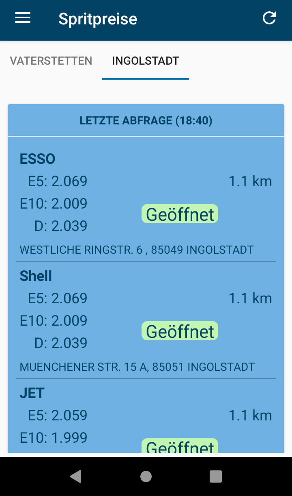
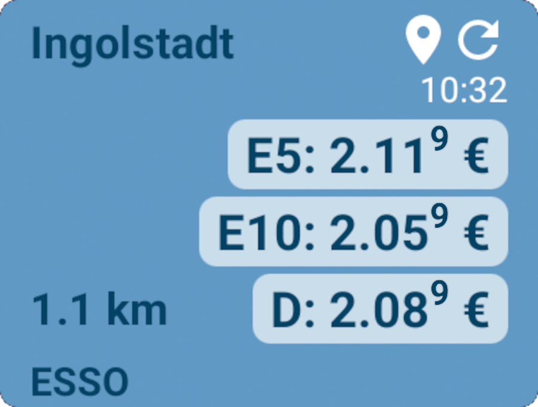

<pre>Send a coffee to woheller69@t-online.de 
</pre>

| **RadarWeather** | **Gas Prices** | **Smart Eggtimer** |
|:---:|:---:|:---:|
| |  |  |
| **Bubble** | **hEARtest** | **GPS Cockpit** |
|  |  |  |
| **Audio Analyzer** | **LavSeeker** | **TimeLapseCam** |
|  | |  |
| **Arity** | **Cirrus** | **solXpect** |
|  |  |  |
| **gptAssist** | **dumpSeeker** | **huggingAssist** |
|  |  |  |
| **FREE Browser** | **whoBIRD**| |
|  |  | |

# Gas Prices Germany

  

Gas Prices Germany provides the prices that the petrol stations report to the market transparency office.
You can choose your own locations and get current gas prices.
Clicking on a gas station in the list or on the icon in the widget shows the gas station in an external map application.
You can also allow the app to use GPS. If you do so and have the app widget installed the position will be updated 
from time to time and the first tab in the app and the widget will show gas stations for your current location.
(This will overwrite the city in your first tab.)
You can also enter your favourite brands in settings. In this case the list in the app will mark your favourite brands
with a star and the widget will show the closest station of one of these brands if available in the search radius.
You can set your preferred fuel type. In this case it is also possible to sort results by price.

The data is provided via the Tankerkönig API under the Creative Commons license “CC BY 4.0” from www.tankerkönig.de.

## License

This app is licensed under the GPLv3, © woheller69.

The app also uses:
- Data is provided via the Tankerkönig API (www.tankerkönig.de) under Creative-Commons-Licence “CC BY 4.0”, <a href='http://creativecommons.org/licenses/by-sa/4.0/'>Creative Commons licence CC BY-SA 4.0</a>
- The code is based on Privacy Friendly Weather (https://github.com/SecUSo/privacy-friendly-weather), which is published under GPLv3
- Icons from [Google Material Design Icons](https://material.io/resources/icons/) licensed under <a href='http://www.apache.org/licenses/LICENSE-2.0'>Apache License Version 2.0</a>
- Material Components for Android (https://github.com/material-components/material-components-android) which is licensed under <a href='https://github.com/material-components/material-components-android/blob/master/LICENSE'>Apache License Version 2.0</a>
- Android Volley (com.android.volley) (https://github.com/google/volley) which is licensed under <a href='https://github.com/google/volley/blob/master/LICENSE'>Apache License Version 2.0</a>
- AndroidX libraries (https://github.com/androidx/androidx) which is licensed under <a href='https://github.com/androidx/androidx/blob/androidx-main/LICENSE.txt'>Apache License Version 2.0</a>
- AutoSuggestTextViewAPICall (https://github.com/Truiton/AutoSuggestTextViewAPICall) which is licensed under <a href='https://github.com/Truiton/AutoSuggestTextViewAPICall/blob/master/LICENSE'>Apache License Version 2.0</a>
- Search-as-you-type location search is provided by [Open-Meteo](https://open-meteo.com/), under <a href='http://creativecommons.org/licenses/by/4.0/'>Attribution 4.0 International (CC BY 4.0)</a>
- osmdroid (https://github.com/osmdroid/osmdroid) licensed under <a href='http://www.apache.org/licenses/LICENSE-2.0'>Apache License Version 2.0</a>

## Contributing

If you find a bug, please open an issue in the Github repository, assuming one does not already exist.
  - Clearly describe the issue including steps to reproduce when it is a bug. In some cases screenshots can be supportive.
  - Make sure you mention the Android version and the device you have used when you encountered the issue.
  - Make your description as precise as possible.

If you know the solution to a bug please report it in the corresponding issue and if possible modify the code and create a pull request.
